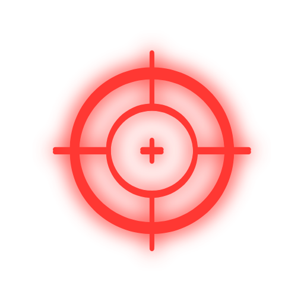

# 3D FPS Maze Game



## Table of Contents
- [Introduction](#introduction)
- [Demo](#demo)
- [Features](#features)
- [Technical Overview](#technical-overview)
- [Detailed Implementation](#detailed-implementation)
  - [Maze Generation](#maze-generation)
  - [Player Controls](#player-controls)
  - [Enemy AI and Pathfinding](#enemy-ai-and-pathfinding)
  - [Rendering Process](#rendering-process)
  - [Collision Detection](#collision-detection)
  - [Power-Up System](#power-up-system)
  - [Health System](#health-system)
  - [User Interface](#user-interface)
  - [Game Loop and Performance](#game-loop-and-performance)
- [What Works](#what-works)
- [Current Limitations](#current-limitations)
- [Installation and Setup](#installation-and-setup)
- [How to Play](#how-to-play)
- [Potential Enhancements](#potential-enhancements)
- [Contributing](#contributing)
- [License](#license)
- [Acknowledgments](#acknowledgments)

## Introduction

This project is a demonstration of a 3D First-Person Shooter (FPS) maze game created using HTML, CSS, JavaScript, and the Three.js library. It showcases what's possible in browser-based 3D gaming and serves as a learning resource for those interested in game development with web technologies.

<video width="640" height="360" controls>
  <source src="images/gameplay.mp4" type="video/mp4">
  Your browser does not support the video tag.
</video>

The most notable aspect of this project is its rapid development time. Using GPT-O1, OpenAI's latest language model with advanced reasoning capabilities, I was able to create this complex demonstration in less than 40 minutes.

## Demo

Try the demo here: https://mohdmahmodi.com/fps/

## Features

- Procedurally generated 3D mazes
- First-person shooter mechanics
- Advanced enemy AI with optimized A* pathfinding
- Two types of power-ups: Walk Through Walls and Fast Shooting
- Progressive difficulty with increasing maze size and enemy count
- Minimap for navigation with toggle for full view
- Performance optimization techniques
- Health system with visual health bar
- Score tracking and round management
- Smooth level transitions with visual effects

## Technical Overview

This demonstration is built entirely in JavaScript using Three.js for 3D rendering. Key components include:

1. Three.js scene setup with main gameplay and minimap scenes
2. Procedural maze generation using a depth-first search algorithm
3. Custom player controls for first-person movement and camera
4. Optimized A* pathfinding for enemy AI using a Min-Heap (Priority Queue)
5. Basic collision detection using bounding boxes and spheres
6. Power-up system with two types of power-ups
7. Health system with visual representation
8. Performance optimizations for smooth rendering
9. User interface elements for game state and player feedback

## Detailed Implementation

### Maze Generation

The maze is generated using a depth-first search algorithm:

1. Initialize a 2D array representing the maze, filled with walls.
2. Start from a random cell (usually (1,1)) and mark it as a path.
3. Push the starting cell onto a stack.
4. While the stack is not empty:
   - Pop a cell from the stack.
   - Check its neighbors (up, right, down, left) that are two steps away.
   - If a neighbor hasn't been visited:
     - Remove the wall between the current cell and the chosen neighbor.
     - Mark the neighbor as visited.
     - Push the neighbor onto the stack.
5. This process creates a perfect maze with no loops or isolated areas.

The maze size increases with each round, providing progressively more challenging levels.

### Player Controls

Player movement and camera controls are implemented using custom JavaScript:

1. Mouse movement is captured to control the camera's pitch and yaw.
2. Keyboard input (W, A, S, D or arrow keys) is used for movement.
3. The player's position is updated based on the input and delta time.
4. Collision detection is performed after movement to prevent wall clipping.

Shooting mechanics are implemented with a cooldown system and bullet management.

### Enemy AI and Pathfinding

Enemies use an optimized A* pathfinding algorithm to navigate the maze:

1. The maze is represented as a grid of nodes.
2. Each node stores its position, whether it's walkable, and pathfinding metadata (f, g, h costs).
3. The A* algorithm uses a Min-Heap as a priority queue for efficiency.
4. Paths are recalculated periodically or when the player moves significantly.
5. Enemies move along the calculated path, updating their position each frame.

Enemies have simple animations for walking and a basic attack system when in close proximity to the player.

### Rendering Process

The game uses two Three.js WebGLRenderer instances:

1. Main scene renderer:
   - Uses a perspective camera for the player's view.
   - Renders the 3D maze, enemies, bullets, and power-ups.
2. Minimap renderer:
   - Uses an orthographic camera for a top-down view.
   - Renders a simplified version of the maze and entity positions.
   - Can be toggled between a local view and a full maze view.

Both renderers update every frame in the main game loop.

### Collision Detection

Collision detection uses a simple sphere-box intersection test:

1. Create a bounding sphere around the player.
2. For each wall in the maze, create a bounding box.
3. Check for intersections between the player's sphere and wall boxes.
4. If a collision is detected, reverse the most recent movement.

Similar collision detection is used for bullet-enemy interactions.

### Power-Up System

The game features two types of power-ups:

1. Walk Through Walls: Allows the player to pass through maze walls temporarily.
2. Fast Shooting: Increases the player's shooting speed for a limited time.

Power-ups are represented as 3D objects in the maze and on the minimap. When collected, they provide temporary effects that modify game mechanics.

### Health System

The player has a health system with the following features:

1. Visual health bar displayed on the screen.
2. Health decreases when attacked by enemies.
3. Color-coded health bar (green, yellow, red) based on remaining health.
4. Game over when health reaches zero.

### User Interface

The game includes several UI elements:

1. Health bar: Visual representation of player health.
2. Scoreboard: Displays current round and remaining enemies.
3. Power-up display: Shows active power-ups and their remaining duration.
4. FPS counter: Displays current frames per second.
5. Crosshair: Indicates the center of the screen for aiming.
6. Message system: Displays temporary messages for game events.
7. Black overlay: Used for smooth transitions between levels.

### Game Loop and Performance

The game uses a fixed time step game loop:

1. The target frame rate is set to 60 FPS.
2. Each frame, the game state is updated based on the elapsed time.
3. Rendering occurs after state updates.
4. FPS is calculated and displayed for performance monitoring.

Performance optimizations include:
- Using `MeshBasicMaterial` instead of more complex materials.
- Disabling shadows and antialiasing.
- Limiting the number of active bullets.
- Reduced geometry for enemies and bullets.
- Throttling certain updates (e.g., pathfinding) to occur less frequently.

## What Works

1. Maze Generation: Successfully creates random, solvable mazes for each level.
2. First-Person Controls: Smooth movement and camera controls in a first-person perspective.
3. Enemy AI: Enemies navigate the maze and chase the player using optimized pathfinding.
4. Shooting Mechanics: Players can shoot bullets that collide with and eliminate enemies.
5. Power-Up System: Two types of power-ups that temporarily modify game mechanics.
6. Minimap: Toggleable minimap that shows player and enemy positions, with full maze view option.
7. Progressive Difficulty: Increasing maze size and enemy count as rounds progress.
8. Health System: Functional health tracking with visual representation.
9. User Interface: Informative UI elements including health bar, round information, and FPS counter.
10. Level Transitions: Smooth transitions between levels with visual effects.

## Current Limitations

1. Collision Detection: 
   - Players may occasionally clip through walls, especially at corners.
   - The sphere-box collision method is simple but not always precise.

2. Enemy Behavior: 
   - Enemies may get stuck in certain maze configurations.
   - Attack mechanics are basic and may feel inconsistent.

3. Performance: 
   - Frame rate may drop in later rounds with larger mazes and more enemies.
   - No level-of-detail system for optimizing rendering of distant objects.

4. Audio: 
   - Currently, there is no sound implementation.

5. Browser Compatibility: 
   - Relies on modern JavaScript features and WebGL, may not work in older browsers.

6. Mobile Support: 
   - Not optimized for touch controls or mobile screens.

7. Save System: 
   - No way to save progress or high scores between sessions.

8. Variety: 
   - Limited enemy types and power-ups may lead to repetitive gameplay.

## Installation and Setup

1. Clone the repository:
   ```
   git clone https://github.com/yourusername/3d-fps-maze-game.git
   ```

2. Navigate to the project directory:
   ```
   cd 3d-fps-maze-game
   ```

3. Open `index.html` in a modern web browser that supports WebGL.

Note: Running through a local web server is recommended to avoid potential CORS issues.

## How to Play

1. Click on the game window to enable mouse controls.
2. Use W/A/S/D or arrow keys to move.
3. Move the mouse to look around.
4. Left-click to shoot.
5. Press 'M' to toggle minimap size.
6. Walk over power-ups to activate them:
   - Blue power-up: Walk Through Walls
   - Red power-up: Fast Shooting
7. Eliminate enemies to progress to the next round.
8. Monitor your health bar and avoid enemy attacks.
9. The game ends when your health reaches zero.

## Potential Enhancements

1. Improved collision detection using more sophisticated algorithms.
2. Enhanced enemy AI with varied behaviors and difficulty levels.
3. Additional weapon types and power-ups.
4. Implement audio for sound effects and background music.
5. Optimization for mobile devices and touch controls.
6. Save system for storing progress and high scores.
7. More varied level designs and objectives.
8. Multiplayer functionality.
9. Advanced graphics with dynamic lighting and shadows.
10. Integration with a backend for leaderboards and user accounts.

## Contributing

This project is primarily a demonstration, but suggestions for improvements are welcome. If you'd like to contribute:

1. Fork the repository
2. Create a feature branch (`git checkout -b feature/YourFeature`)
3. Commit your changes (`git commit -m 'Add YourFeature'`)
4. Push to the branch (`git push origin feature/YourFeature`)
5. Open a Pull Request

## License

This project is open source and available under the [MIT License](LICENSE).

## Acknowledgments

- Developed by: [Mohd Mahmodi](https://mohdmahmodi.com)
- Contact: contact@mohdmahmodi.com
- X / Twitter: [@mohdmahmodi](https://x.com/mohdmahmodi)
- GPT-O1 by OpenAI for development assistance
- Three.js library for 3D rendering

This project demonstrates the potential of AI-assisted rapid prototyping in game development and serves as a starting point for those interested in browser-based 3D games.